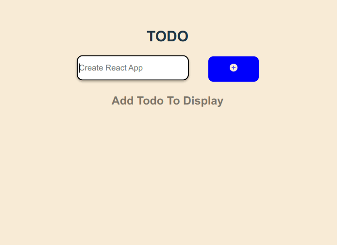

# TODO App

[](https://todo-react91.netlify.app/)

## Features

-   Create Todo
-   Remove Todo
-   Message on Empty Input Submit
-

### Languages and Tools:

<p align="left"><a href="https://www.w3.org/html/" target="_blank">  </a> <a href="https://www.w3schools.com/css/" target="_blank">  </a>
 <a href="https://developer.mozilla.org/en-US/docs/Web/JavaScript" target="_blank">  </a>
 <a href="https://reactjs.org/" target="_blank">  </a></p>

### Installation

```sh
$ cd Todo-React
$ npm i
$ npm start
```

### Custom Hook (**useList**)

```javascript
const useList = () => {
	const [list, setList] = useState([]);

	const push = (newItem) => {
		if (newItem === "") return;
		let newList = [...list, newItem];
		console.log(newList);
		setList(newList);
	};

	const pop = (removeIndex) => {
		let newList = list.filter((item, index) => index != removeIndex);
		console.log(newList);
		setList(newList);
	};
	return {
		list: list,
		push: push,
		pop: pop,
	};
};
```
